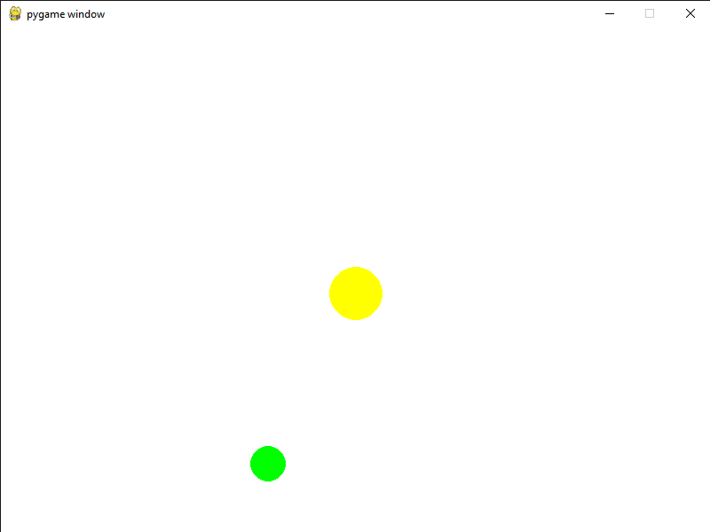
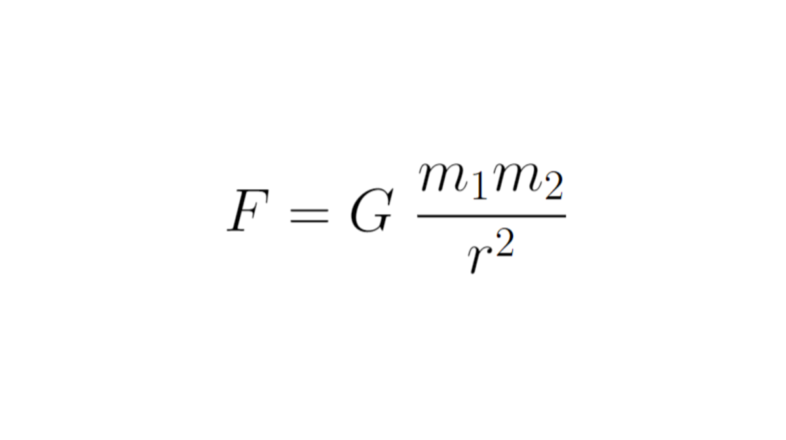
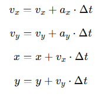
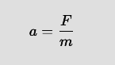

# Orbital motion

## What i do to make this project?

For each object in the project, I created a separate class that contained functions for determining gravity, drawing, and updating velocity and position.

## The force of gravity

In my project I defined it using this formula: 
### G * m₁ * m₂ / r^2  
#### Where:  
  
 **G** ⏤ Gravitational constant\
 **m** ⏤ mass\
 **r** ⏤ distance between object1 and object2

This formula returns only the force modulus  
To get a vector for x and y I use the arctan function - the opposite of tan with the values ​​Δx, Δy  
**Δx** ⏤  x2 - x1  
**Δy** ⏤  y2 - y1  
Next, I use cosine and sine to determine the horizontal (x) and vertical (y) respectively, multiplying them by force

## Updating velocity and position

To update the velocity and positions, I used Euler's method and Newton's second law:  

Euler's method:  

Where:  
**v** ⏤ velocity  
**a** ⏤ acceleration  
**x** ⏤ position x  
**y** ⏤ position y  
​**Δt** ⏤ delta time (in my case it's TIMESTEP)

Newton's second law for finding acceleration:  
  
Where:  
**F** ⏤ force  
**m** ⏤ mass

## Drawing
This is a common method for drawing objects in pygame but using SCALE to make the object fit on the screen.

## What can be depicted

This program can draw a circular object of any color, any radius, any position (x, y), and any mass.

This is what it looks like in the example:  
### "Model of sun" ⏤ `Object_(WIDTH / 2, HEIGHT / 2, 30, pg.Color('Yellow'), 1.989e30)` 
### Where:  
**WIDTH / 2, HEIGHT / 2** ⏤ x, y cordinate  
**30** ⏤ radius  
**pg.Color('Yellow')** ⏤ color  
**1.989e30** ⏤ mass

## How can this be used?

This is just a simulation of orbital motion. Can be used as a toy

### People
[@tolikhalas](https://github.com/tolikhalas)

